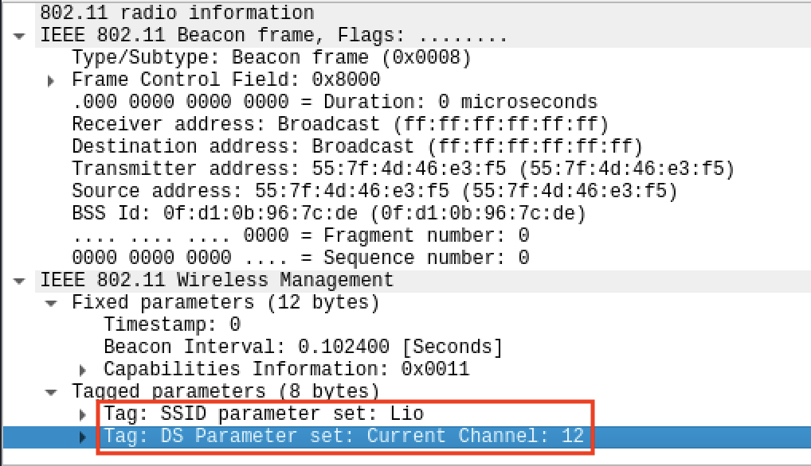
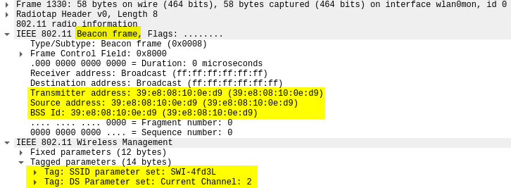
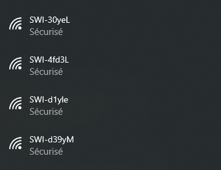
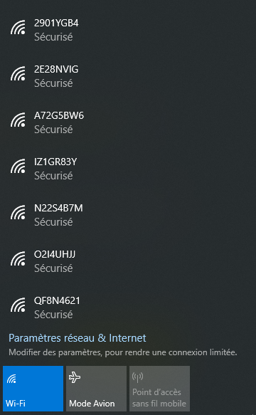

[Livrables](#livrables)

[Échéance](#échéance)

[Quelques pistes importantes](#quelques-pistes-utiles-avant-de-commencer-)

[Travail à réaliser](#travail-à-réaliser)

1. [Deauthentication attack](#1-deauthentication-attack)
2. [Fake channel evil tween attack](#2-fake-channel-evil-tween-attack)
3. [SSID Flood attack](#3-ssid-flood-attack)

# Sécurité des réseaux sans fil

## Laboratoire 802.11 MAC 1

### 1. Deauthentication attack

a) Utiliser la fonction de déauthentification de la suite aircrack, capturer les échanges et identifier le Reason code et son interpretation.

**SCREENSHOTS**

__Question__ : quel code est utilisé par aircrack pour déauthentifier un client 802.11. Quelle est son interpretation ?

Code 7:	"Class 3 frame received from nonassociated station"

Les trames de classe 3 comprennent les types suivants:
* Data frames
* Management frames
* Control frames (power management)

Dans ce cas, cela signifie qu'une trame du mauvais type a été reçue par le BSS car celui-ci ne s'attend pas à recevoir une trame de classe 3 à partir d'une STA non-associée, causant ainsi la disassociation du système.

__Question__ : A l'aide d'un filtre d'affichage, essayer de trouver d'autres trames de déauthentification dans votre capture. Avez-vous en trouvé d'autres ? Si oui, quel code contient-elle et quelle est son interpretation ?

b) Développer un script en Python/Scapy capable de générer et envoyer des trames de déauthentification. Le script donne le choix entre des Reason codes différents (liste ci-après) et doit pouvoir déduire si le message doit être envoyé à la STA ou à l'AP :
* 1 - Unspecified
* 4 - Disassociated due to inactivity
* 5 - Disassociated because AP is unable to handle all currently associated stations
* 8 - Deauthenticated because sending STA is leaving BSS

Chemin du script `/scripts/SWI-Lab-01-Deauthentication-Attack.py`

Utilisation :

```
root@kali:/home/kali/Desktop# python SWI-Lab-Deauth.py --help
usage: SWI-Lab-Deauth.py [-h] -r REASON -b BSSID -s STA [-c COUNT]

802.11 deauth script

optional arguments:
  -h, --help            show this help message and exit
  -r REASON, --reason REASON
                        The 802.11 deauthentification reason code.
  -b BSSID, --BSSID BSSID
                        BSSID
  -s STA, --STA STA     STA
  -c COUNT, --count COUNT
                        Number of packets to send
```

__Question__ : quels codes/raisons justifient l'envoie de la trame à la STA cible et pourquoi ?

* 1 - Unspecified  
Nous n'avons pas trouvé 
* 4 - Disassociated due to inactivity  
Le BSS a détecté que la STA a atteint le temps limite d'inactivité et est par conséquent disassociée du système.
* 5 - Disassociated because AP is unable to handle all currently associated stations  
Le BSS n'arrive plus à supporter la charge actuelle et disassocie la STA pour libérer des ressources.

__Question__ : quels codes/raisons justifient l'envoie de la trame à l'AP et pourquoi ?

* 8 - Deauthenticated because sending STA is leaving BSS  
La STA se déconnecte (à cause de la qualité du signal ou un changement de SSID par exemple) et notifie ainsi le BSS qu'elle quitte le système.

__Question__ : Comment essayer de déauthentifier toutes les STA ?

En observant le traffic il est possible d'identifier les STA actuellement connectés sur le point d'accès et ainsi envoyer des trames de disassiocation à leur place.

__Question__ : Quelle est la différence entre le code 3 et le code 8 de la liste ?

Le code 3 est utilisé dans un IBSS ou ESS alors que le code 8 est utilisé pour un BSS.

__Question__ : Expliquer l'effet de cette attaque sur la cible

Le BSS va comprendre que la station à l'intention de quitter la système et va donc invalider sa session. La cible devra s'authentifier à nouveau sur le BSS.

### 2. Fake channel evil tween attack
a)	Développer un script en Python/Scapy avec les fonctionnalités suivantes :

* Dresser une liste des SSID disponibles à proximité
* Présenter à l'utilisateur la liste, avec les numéros de canaux et les puissances
* Permettre à l'utilisateur de choisir le réseau à attaquer
* Générer un beacon concurrent annonçant un réseau sur un canal différent se trouvant à 6 canaux de séparation du réseau original

Chemin du script `/scripts/SWI-Lab-01-Fake-Channel-Evil-Tween-Attack.py`

Utilisation: 

```
(venv) root@kali:~/PycharmProjects/SWI_Labo1# python SWI-Lab-01-Fake-Channel-Evil-Tween-Attack.py 
In progress...
+-------+------------------------------+---------+---------+
| Index |             SSID             | Channel |  Signal |
+-------+------------------------------+---------+---------+
|   0   | HP-Print-37-ENVY 4500 series |    6    | -68 dBm |
|   1   |             Lio              |    6    |  -9 dBm |
|   2   |      Mutluer & Nidecker      |    6    | -67 dBm |
|   3   |           net+ Fon           |    6    | -70 dBm |
|   4   |            mlink             |    6    | -71 dBm |
|   5   |        netplus-ae41d0        |    6    | -69 dBm |
|   6   |           net+ Fon           |    6    | -73 dBm |
|   7   |       PS4-FD00738233A9       |    6    | -71 dBm |
|   8   |     devolo-f4068d9ef780      |    6    | -72 dBm |
|   9   |        netplus-6b9298        |    6    | -71 dBm |
|   10  |          pnu-05961           |    6    | -73 dBm |
|   11  |          ogg-35243           |    6    | -68 dBm |
+-------+------------------------------+---------+---------+

Choose the index of the SSID you want to attack: 

```

Il est possible de spécifier l'interface à utiliser, wlan0mon est utilisé par défaut.

Capture Wireshark d'un Beacon généré avec le script: 

On voit par rapport à l'exemple d'utlisiation, qu'un nouvel AP avec le SSID Lio et le canal 12 existe. 



__Question__ : Expliquer l'effet de cette attaque sur la cible

```
Il n'y a pas d'effet sur la cible. Il faudrait que la cible se déconnecte du vrai AP et se reconnecte, sans le savoir (en y étant forcé, signal plus fort, etc.), sur le faux pour ainsi appliquer une attaque non developpé ici. La première partie du laboratoire pourrait nous aider dans cette tâche.
```


### 3. SSID flood attack

Chemin du script `/scripts/SWI-Lab-01-SSID-Flood-Attack.py`

Utilisation:

```
root@kali:/home/kali/Desktop# python3 SWI-Lab-01-SSID-Flood-Attack.py --help
usage: SWI-Lab-01-SSID-Flood-Attack.py [-h] [-f FILEPATH] [-c COUNT]
                                       [-i IFACE]

SWI-Lab-01-SSID-Flood-Attack

optional arguments:
  -h, --help            show this help message and exit
  -f FILEPATH, --filepath FILEPATH
                        File with the list of SSID to generate.
  -c COUNT, --count COUNT
                        Number of SSID to generate if no file is provided.
  -i IFACE, --iface IFACE
                        Interface used for the attack
````

Capture Wireshark d'un Beacon généré avec le script:



#### Exemple 1: flooding à partir d'une liste

```
root@kali:/home/kali/Desktop# cat ssid.txt 
SWI-4fd3L
SWI-30yeL
SWI-d39yM
SWI-d1yle

root@kali:/home/kali/Desktop# python3 SWI-Lab-01-SSID-Flood-Attack.py --filepath ssid.txt
SSID: SWI-4fd3L; BSSID: 39:e8:08:10:0e:d9; Channel: 2
SSID: SWI-30yeL; BSSID: 96:56:9c:61:2d:3a; Channel: 4
SSID: SWI-d39yM; BSSID: 45:23:0f:57:03:f6; Channel: 1
SSID: SWI-d1yle; BSSID: cc:cd:1c:fe:6e:f7; Channel: 9
SSID flooding started...
```

Visibilité des SSIDs depuis Windows:



#### Exemple 2: flooding avec des SSIDs générés aléatoirement

```
root@kali:/home/kali/Desktop# python3 SWI-Lab-01-SSID-Flood-Attack.py --count 10
SSID: A72G5BW6; BSSID: 0f:f9:7d:07:95:24; Channel: 7
SSID: QQ3FOVO2; BSSID: 1a:f7:56:0c:69:96; Channel: 5
SSID: YR3S15TE; BSSID: cc:82:05:1f:af:8c; Channel: 4
SSID: 2901YGB4; BSSID: 0e:87:87:de:1f:68; Channel: 7
SSID: O2I4UHJJ; BSSID: ab:5c:57:a2:8e:61; Channel: 4
SSID: 2E28NVIG; BSSID: 8b:0e:11:93:15:2a; Channel: 2
SSID: IZ1GR83Y; BSSID: ff:1a:e4:6e:e2:59; Channel: 5
SSID: QF8N4621; BSSID: de:0a:0a:69:79:aa; Channel: 8
SSID: N22S4B7M; BSSID: b3:c4:9e:b3:31:1c; Channel: 12
SSID: ST25INYF; BSSID: ee:fc:25:70:88:f1; Channel: 12
SSID flooding started...
```

Visibilité des SSIDs depuis Windows:



## Livrables

Un fork du repo original . Puis, un Pull Request contenant :

- Script de Deauthentication de clients 802.11 __abondamment commenté/documenté__

- Script fake chanel __abondamment commenté/documenté__

- Script SSID flood __abondamment commenté/documenté__

- Captures d'écran du fonctionnement de chaque script

-	Réponses aux éventuelles questions posées dans la donnée. Vous répondez aux questions dans votre ```README.md``` ou dans un pdf séparé

-	Envoyer le hash du commit et votre username GitHub par email au professeur et à l'assistant
